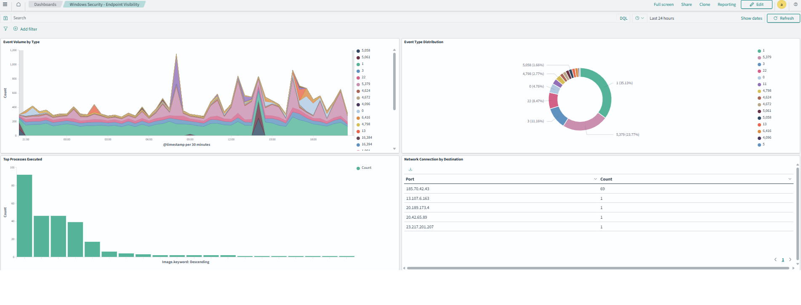
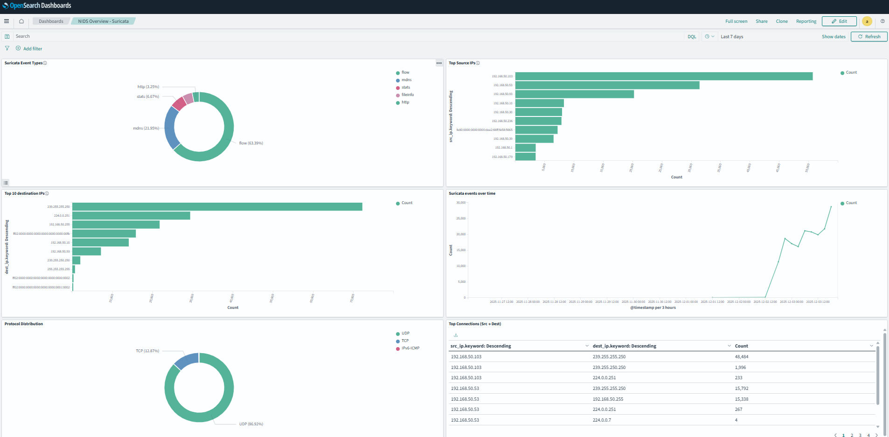

# HomeLab-SOC

A fully functional home lab Security Operations Center featuring SIEM, network intrusion detection, and endpoint monitoring. Built as a portfolio project to demonstrate practical cybersecurity skills.

## Architecture
```text
                            ┌─────────────────────┐
                            │      Internet       │
                            └──────────┬──────────┘
                                       │
                            ┌──────────▼──────────┐
                            │   ASUS ZenWiFi BQ16 │
                            │    (192.168.50.1)   │
                            └──────────┬──────────┘
                                       │
               ┌───────────────────────┼───────────────────────┐
               │                       │                       │
     ┌─────────▼─────────┐   ┌────────▼────────┐   ┌─────────▼─────────┐
     │  Windows Endpoint │   │    QNAP NAS     │   │   TP-Link Switch  │
     │  (CHAPPY-MCNASTY) │   │  (192.168.50.10)│   │   Port Mirroring  │
     │                   │   │                 │   │                   │
     │  - Sysmon         │   │  - OpenSearch   │   │                   │
     │  - Fluent Bit     │   │  - Suricata     │   │                   │
     │                   │   │  - Fluent Bit   │   │                   │
     └─────────┬─────────┘   │  - Dashboards   │   └───────────────────┘
               │             └────────▲────────┘
               │                      │
               └──────────────────────┘
                     Logs & Alerts
```

## Components

| Component | Technology | Purpose |
|-----------|------------|---------|
| **SIEM** | OpenSearch + Dashboards | Log aggregation, search, visualization |
| **NIDS** | Suricata | Network intrusion detection (46K+ rules) |
| **Log Shipping** | Fluent Bit | Collect and forward logs from all sources |
| **Endpoint Monitoring** | Sysmon | Process creation, network connections, DNS queries |
| **Network Capture** | Port Mirroring | Full packet visibility |

## Dashboards

### Windows Security - Endpoint Visibility


**Panels:**
- Event Volume by Type (timeline)
- Event Type Distribution (donut chart)
- Top Processes Executed
- Network Connections by Destination
- DNS Queries - Top Domains
- Parent-Child Process Tree
- Process Execution by User

### NIDS Overview - Suricata


**Panels:**
- IDS Alerts Over Time
- Top Alert Signatures
- Traffic by Protocol
- Top Source/Destination IPs
## Detection Capabilities

### Endpoint (Sysmon)
- Process creation with full command line
- Parent-child process relationships
- Network connections per process
- DNS query logging
- File creation monitoring
- Registry modifications

### Network (Suricata)
- 46,634 detection rules (ET Open)
- Protocol anomaly detection
- Known malware signatures
- Exploit attempt detection

## Repository Structure
```text
HomeLab-SOC/
├── configs/
│   ├── fluent-bit/          # Log collection configs
│   ├── suricata/            # IDS configuration
│   └── opensearch/          # SIEM settings
├── dashboards/              # Exported dashboard JSON
├── docs/                    # Setup guides
├── scripts/                 # Utility scripts
└── screenshots/             # Dashboard images
```

## Key Achievements

- **Custom Lua Parser:** Built Sysmon field extraction for Fluent Bit, enabling granular endpoint visibility
- **Multi-Source Correlation:** Windows events, network IDS, and syslog unified in single SIEM
- **Real-Time Detection:** Live Suricata capture with 46K+ signatures
- **Scalable Architecture:** Container-based deployment on QNAP NAS

## What I Learned

- Log pipeline architecture (collection → parsing → indexing → visualization)
- Sysmon configuration for threat detection
- OpenSearch query language and dashboard creation
- Suricata rule management and tuning
- Docker container orchestration
- Network traffic analysis fundamentals

## Roadmap

- [ ] Threat intel feed integration (Abuse.ch, AlienVault OTX)
- [ ] GeoIP enrichment for network traffic
- [ ] Email alerting for high-priority detections
- [ ] Sigma rule implementation
- [ ] Purple team exercises with Atomic Red Team

## Author

**Brian Chaplow**
- GitHub: [@brianchaplow](https://github.com/brianchaplow)
- LinkedIn: [brianchaplow](https://www.linkedin.com/in/brianchaplow)
- Website: [brianchaplow.com](https://brianchaplow.com)

## License

MIT License - See [LICENSE](LICENSE) for details.